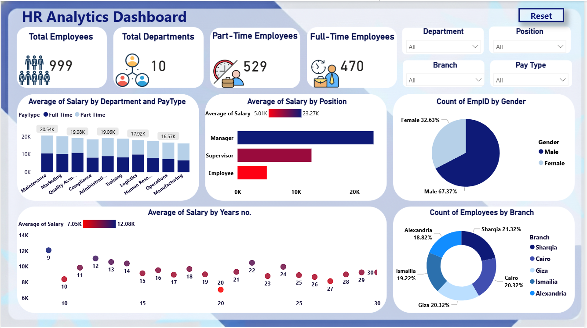

# HR-Analytics-Dashboard

##  Project Objective
The objective of this HR Power BI dashboard is to analyze employee demographics, salary distribution, and years of experience in order to provide insights that support fair and data-driven salary decisions.

##  Dataset Fields
The dataset includes:
- Age  
- Branch  
- Department  
- Date of Birth  
- Employee ID  
- Gender  
- Hire Date  
- ID Number  
- Name  
- Pay Type (Full-Time / Part-Time)  
- Place of Birth  
- Position  
- Salary  
- Years of Experience  

---

##  Dashboard Overview
This dashboard provides a complete overview of workforce structure and compensation, including:

### **Workforce KPIs**
- Total Employees: **999**
- Total Departments: **10**
- Part-Time Employees: **529**
- Full-Time Employees: **470**

### **Key Analyses**
#### 🔹 **Salary Analysis**
- Average Salary by Department & Pay Type  
- Average Salary by Position  
- **Salary vs Years of Experience (scatter plot)**  

#### 🔹 **Demographic Analysis**
- Employee distribution by Gender  
- Employee count by Branch  

---

## Slicers Used
The dashboard includes interactive slicers for:
- Department  
- Position  
- Branch  
- Pay Type  

These allow users to filter the data dynamically for deeper analysis.

---

## Insights Summary
- Managers have the highest average salary, followed by Supervisors.  
- Salary increases consistently with years of experience, as seen in the scatter plot trend.  
- Workforce distribution is uneven across branches, with Sharqia and Cairo slightly higher.  
- Males represent approximately 67% of the workforce, while females represent 33%.  
- Some departments show noticeable differences in full-time vs part-time salary averages.
 

---

